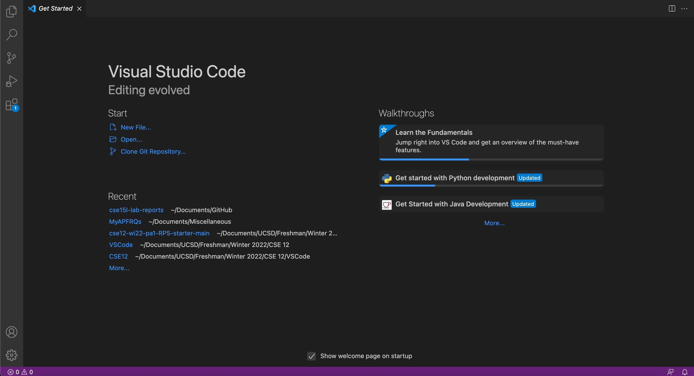
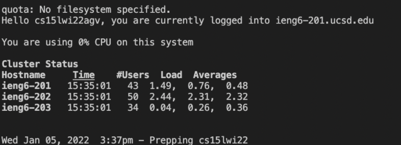
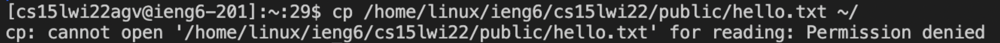
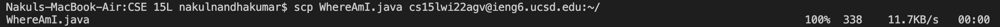
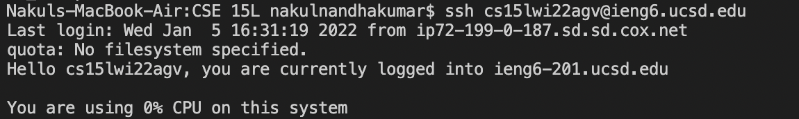
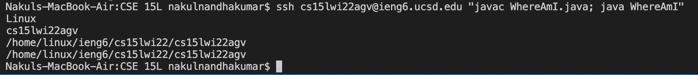

# Remote Access - Setting Up and Using Your CSE15L Account

## Step #1: Installing VSCode
-----
- Open the [Visual Studio Code](https://code.visualstudio.com/) website
- Find and follow the instructions for downloading VSCode onto your machine, varies depending on OS
- After opening VSCode, it will look like the below screenshot    

  

## Step #2: Remotely Connecting
-----
- If you're on Windows, go to [this link](https://docs.microsoft.com/en-us/windows-server/administration/openssh/openssh_install_firstuse) and install OpenSSH
- Then, navigate to [this link](https://sdacs.ucsd.edu/~icc/index.php) and find your course specific CSE15L account username (i.e. cs15lwi22agv@ieng6.ucsd.edu but after cs15lwi22 you will have your own unique 3 characters)
- Open a new terminal in VSCode and enter this command (replace with your username):  `ssh cs15lwi22agv@ieng6.ucsd.edu`
- When prompted, type `yes` and press enter. You are now logged in to a computer in the CSE bulding basement
  

  

## Step #3: Trying Some Commands
-----
- Now try a few commands.
- `ls` will show the files and directories on the computer you are logged in to
- `ls -a` will show hidden files in addition to the regular files and directories
- `cp <filename>` will attemp to copy a file however if you attempt to copy a file from another computer's directory, you will receive a permission denied error
  

  

## Step #4: Moving Files with `scp`
-----
- You can use `scp` to secure copy files from your local computer computer to the computer in the CSE15L basement
- Use the following command strcuture:  
`scp <filetocopy> <cse15laccountusername>: <locationonserver>`
- You will be prompted to enter your password to log in to your CSE15L account
- For example:  
`scp WhereAmI.java cs15lwi22agv@ieng6.ucsd.edu:~/`
would copy the file WhereAmI.java from your local machine into the root directory on the server
  

  

## Step #5: Setting an SSH Key
-----
- Create an ssh public and private key on your local machine by running the following command:  
`ssh-keygen`
- When asked which file to save the key in type:  
`/Users/<yourusernamehere>/.ssh/id_rsa`
- When prompted to enter a passphrase you may either chose to add one or leave it blank and hit enter
- If you're on Windows, you must click on [this link](https://docs.microsoft.com/en-us/windows-server/administration/openssh/openssh_keymanagement#user-key-generation) and follow the additional steps for setting up an ssh key
- Log in to your CSE15L account on the server: 
`ssh <youraccountusername>`
- Make a directory called `.ssh` using the `mkdir` command:  
`mkdir .ssh`  
Don't worry if it doesn't show up when you type `ls`. It is a hidden directory so you need to list all files by typing `ls -a` in order to see and access the directory
- Log out of the server and run:  
`scp /Users/<yourlocalusername>/.ssh/id_rsa.pub <yourcse15laccountusername>:~/.ssh/authorized_keys`
- Now, when you run the `ssh` command to login, you will not have to enter a password anymore
  

  

## Step #6: Optimizing Remote Running
-----
- Although you don't have to enter a password anymore, it can still be very troublesome to have to log in, run commands, then log back out
- You can combine multiple commands into one line through using semicolons and quotation marks
- `javac WhereAmI.java; java WhereAmI`  
will first run javac then java
- `ssh <youraccountusername> "javac WhereAmI.java; java WhereAmI` 
will log on to your server account, then compile and run a java file, then exit all in one line!
- Using the uparrow will let you return to a command you have previously entered as well
  
