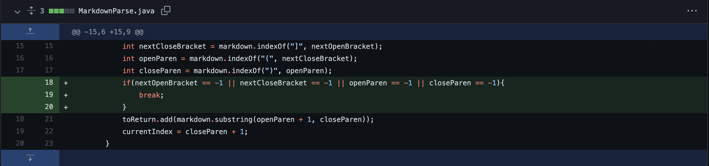
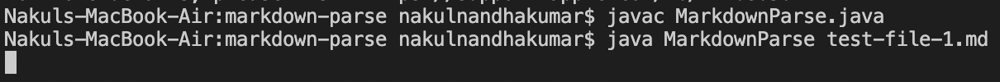
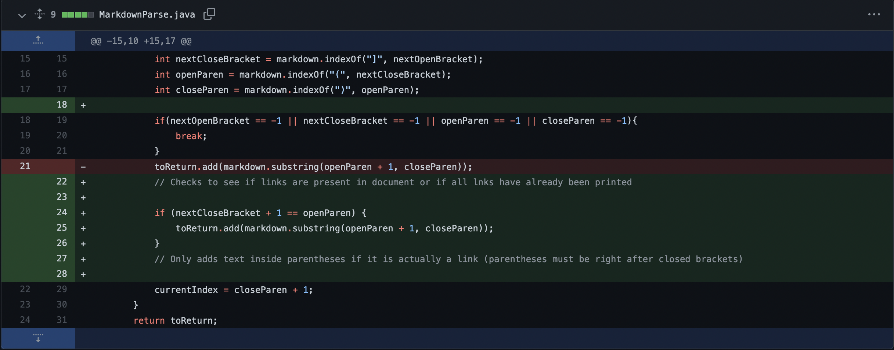
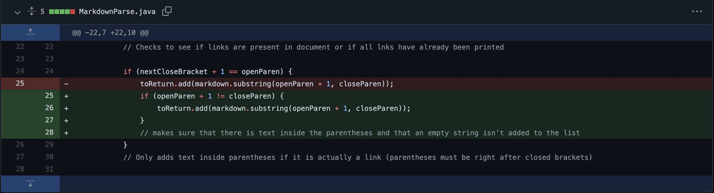
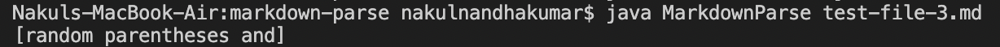

# Debugging - Failure-Induing Inputs, Bugs, and Symptoms 

**debugging** (*verb*) - a special process where a programmer is the detective, criminal, AND the victim

   

## Code Change #1
---

[**Link to Test File With Failure-Inducing Input**](https://github.com/nakulnandhakumar/markdown-parse/blob/main/test-file-1.md)

[**MarkdownParse Version with Failing Code**](https://github.com/nakulnandhakumar/markdown-parse/commit/d7eb559117ae20d0b0970d5f56625c5da6bebc8b#diff-c703a0ec03474d601c6bf846740b293e0538bccf38d5f677a302457479e9c652L1-L43)
  

### **Symptom:**

(The lack of output above after running the program using command line means that the program entered an infinite loop)
  

### **Explanation**

In the original piece of code written by Professor Politz, the code would only work on files where the last piece of information was a link and the last character was a closed parentheses. The ***BUG*** in the code was that the program only stopped searching for links when `currentIndex >= markdown.length`. However, if there was any extra words or information after the last link in the file (***FAILURE-INDUCING INPUT***), then the program would keep searching for the next link. It would try to find the next open bracket and if it didn't find any, it would assign `-1` to `nextOpenParen` and to subsequent index variables. `currentIndex` would never be less than the number of characters in the markdown file and the program would enter into an infite loop, which is the ***SYMPTOM*** of the bug. 

   

## Code Change #2
---

[**Link to Test File With Failure-Inducing Input**](https://github.com/nakulnandhakumar/markdown-parse/blob/main/test-file-2.md)

[**MarkdownParse Version with Failing Code**](https://github.com/nakulnandhakumar/markdown-parse/commit/d7eb559117ae20d0b0970d5f56625c5da6bebc8b#diff-c703a0ec03474d601c6bf846740b293e0538bccf38d5f677a302457479e9c652L1-L43)
  

### **Symptom:**

(The blank space after `somewords` in the list is an empty string that is inside the list)
  

### **Explanation**

The goal of the code written by Professor Politz is to return all links but not image links inside of a markdown file. However, there is a ***BUG*** in the code where the program would take the subtstring between the indexes represented by `openParen` and `closedParen`. If these two variables represented indexes that were right next to each other, then the substring function would return an empty string. The only way that this case would occur was if there was ***FAILURE-INDUCING INPUT*** markdown text in the form of `[<linktext>]()`. The ***SYMPTOM*** of the bug would be the program taking this empty string returned by the substring function and adding it to the list that holds all of the markdown file's links.

   

## Code Change #3
---

[**Link to Test File With Failure-Inducing Input**](https://github.com/nakulnandhakumar/markdown-parse/blob/main/test-file-3.md)

[**MarkdownParse Version with Failing Code**](https://github.com/nakulnandhakumar/markdown-parse/commit/d7eb559117ae20d0b0970d5f56625c5da6bebc8b#diff-c703a0ec03474d601c6bf846740b293e0538bccf38d5f677a302457479e9c652L1-L43)
  

### **Symptom:**

(`random parentheses and` is not a link in the markdown text file)
  

### **Explanation**

The method Professor Plitz used to search for links is by finding the characters associated with the specific markdown syntax required to define a link. However, there is a ***BUG*** in the code where the program would find the index of the first `openParen` that appears after the index of the first `nextClosedBracket` without making sure that the open parantheses is immediately after the closed bracket. ***FAILURE-INDUCING INPUT*** where a file could have and open and closed bracket around some text, then more text, and then an open and closed parentheses would cause the program to fail. The ***SYMPTOM*** of the bug would be the program taking the text inside the open and closed parentheses when the text inside isn't a link because it doesn't appear immediately after the brackets.