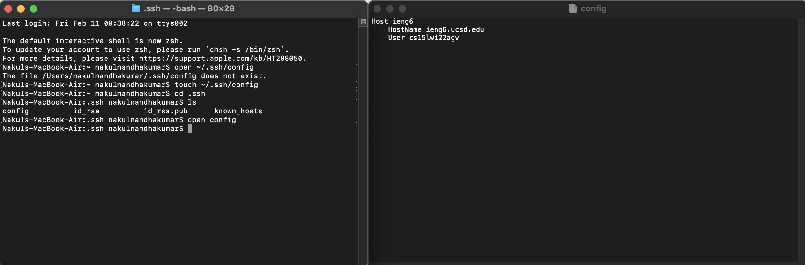
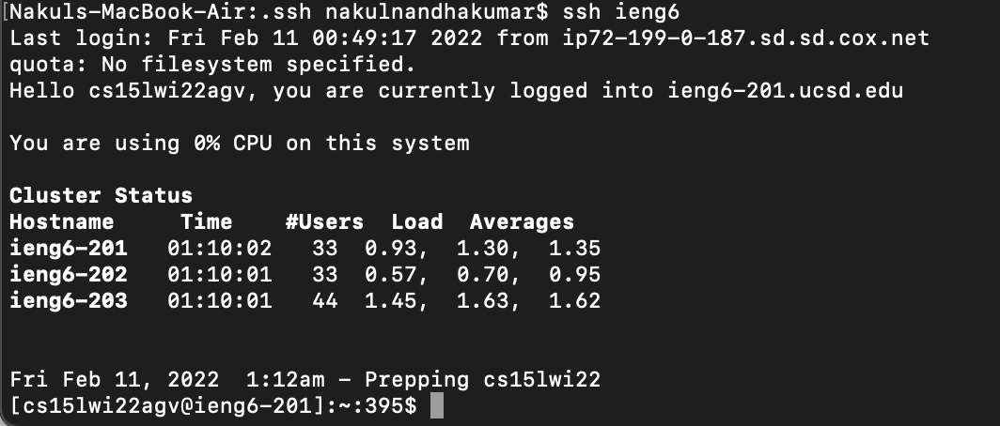
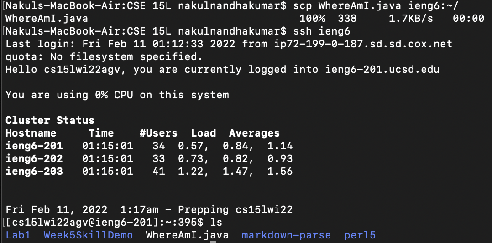

# Streamlining ssh Configuration

 

### **Creating and Editing `~/.ssh/config`**
---
 

 
I created a file using the command `touch` followed by the path of the file (which includes the file) that I want to create. In this case, it was `touch ~/.ssh/config`. I then used `open ~/.ssh/config` to open the config file in my local text editor. I then added the hostname and username of my CSE15l account along with the alias I want to use at the top.
   

### **Login to CSE15l Account Using Alias**
---
 

 
After creating and editing `~/.ssh/config`, I then entered the command `ssh ieng6`. This allowed me to login to my CSE15l account without having to type my username and the host name, which is very easy to forget.
  

### **`scp` Using Chosen Alias**
---
 

 
I then tested securely copying over a file, WhereAmI.java, to my CSE15l account using `scp WhereAmI.java ieng6:~/`. If I didn't define a config file with an alias I could use to login, I would have to type my username and host name inplace of the `ieng6` in the command, which takes more time and has a higher risk of being mistyped.
   
