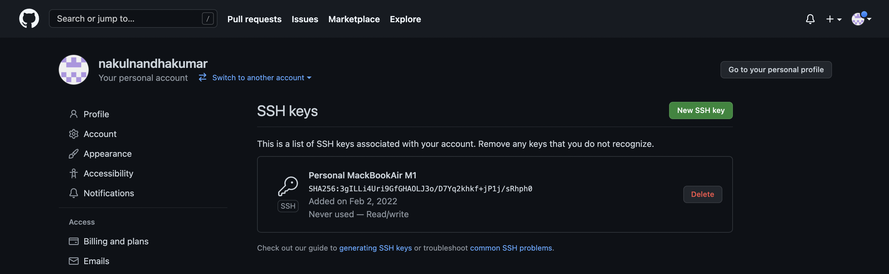

# Setup Github Access From ieng6

 

## Public RSA Key
---

(`id_rsa_github.pub` is the file with the public key which is also stored in Github)
  

## Private RSA Key
---

(`id_rsa_github` is the file with the private key)
  

## Running Git Commands From ieng6 Terminal
---

   

## Link to Commit From Terminal Git Commit
---

  