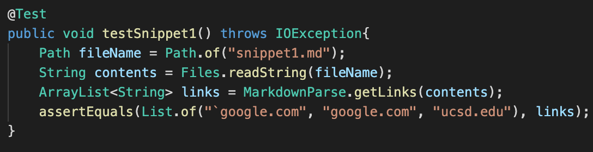
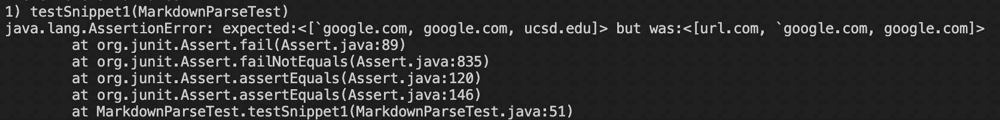
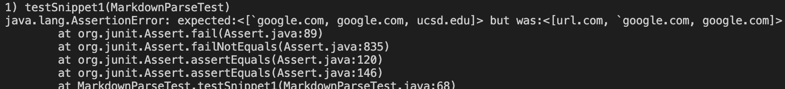
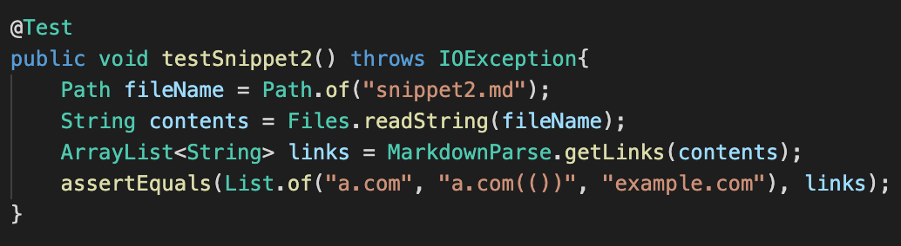
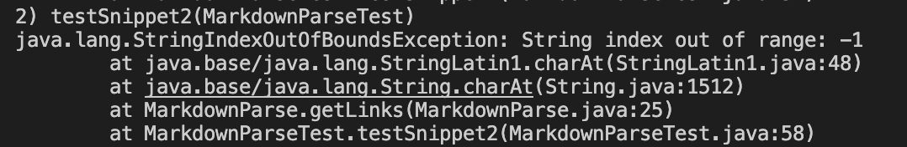
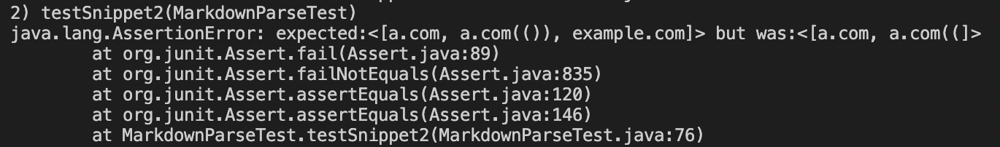
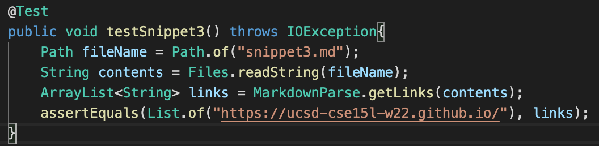
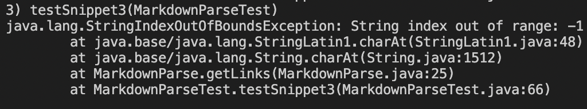
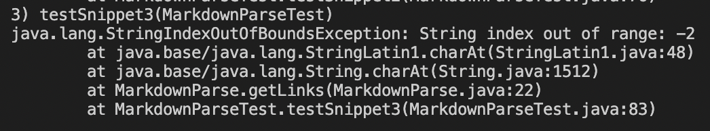

# Markdown Code Snippets Code Review

 

### **[Link to My MarkdownParse Repository](https://github.com/nakulnandhakumar/markdown-parse)**
### **[Link to Kathy's MarkdownParse Repository](https://github.com/kathyychenn/markdown-parse)**
---
 

## **Snippet 1**
**Expected Output:** *[`google.com, google.com, ucsd.edu]*  
**JUnit Test:** 

 

**My Output: FAILED** 

**Kathy's Output: FAILED** 

---
   

## **Snippet 2**
**Expected Output:** *[a.com, a.com(()), example.com]*  
**JUnit Test:** 

 

**My Output: FAILED** 

**Kathy's Output: FAILED** 

---
   

## **Snippet 3**
**Expected Output:** *[https://ucsd-cse15l-w22.github.io/]*  
**JUnit Test:** 

 

**My Output: FAILED** 

**Kathy's Output: FAILED** 

---
   

## **QUESTIONS**
---

**#1: Do you think there is a small (<10 lines) code change that will make your program work for snippet 1 and all related cases that use inline code with backticks? If yes, describe the code change. If not, describe why it would be a more involved change.** 
  
Yes, there is a small code change that would fix my program. I could add variables that store the indexes of where backticks appear as well as check for all occurences of brackets. I could then check if one, or both brackets of a link are enclosed inside the backticks. If that is the case, I will not add the link after the brackets, unless there is another pair of brackets outside the backticks that encloses both backticks. It doesn't matter if a backtick appears inside a parenthesis or not. This could be done in 10 lines or fewer since it involves some variable declarations and a few if statments.  
  

**#2: Do you think there is a small (<10 lines) code change that will make your program work for snippet 2 and all related cases that nest parentheses, brackets, and escaped brackets? If yes, describe the code change. If not, describe why it would be a more involved change.** 
  
No I don't think so. We would have to create variables to store every single occurence of brackets in the markdown parse file. Then we would check for brackets inside other brackets. If there are, we can check for a link and then just add the link inside of the link before searching for the next open bracket which would skip the outside link. We could also add if statments checking for backslashes which would tell us to ignore those brackets when finding our link. We would need to create a relatively long method in order to count and keep track of open and closed parentheses so we could truly find enclosed parentheses in the link. This would all take more than ten lines.
  

**#3: Do you think there is a small (<10 lines) code change that will make your program work for snippet 2 and all related cases that nest parentheses, brackets, and escaped brackets? If yes, describe the code change. If not, describe why it would be a more involved change.** 
  
Yes, it is possible to do this in less than ten lines. We could just add some if statements checking for whitespace and new lines and the remove them from the final link. This would only need to be done for inside the parentheses of a link since it doesn't matter for the brackets. We could also add an if statement that finds the next open bracket if there is another one if a closed parentheses is missing after an open parentheses.  This would only take a few if statments and a few more lines to cut out whitespace and new line characters.
