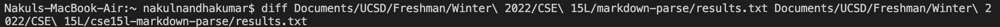
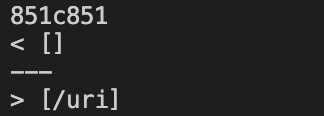
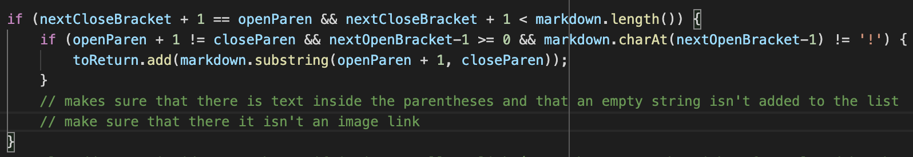
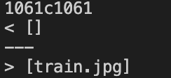
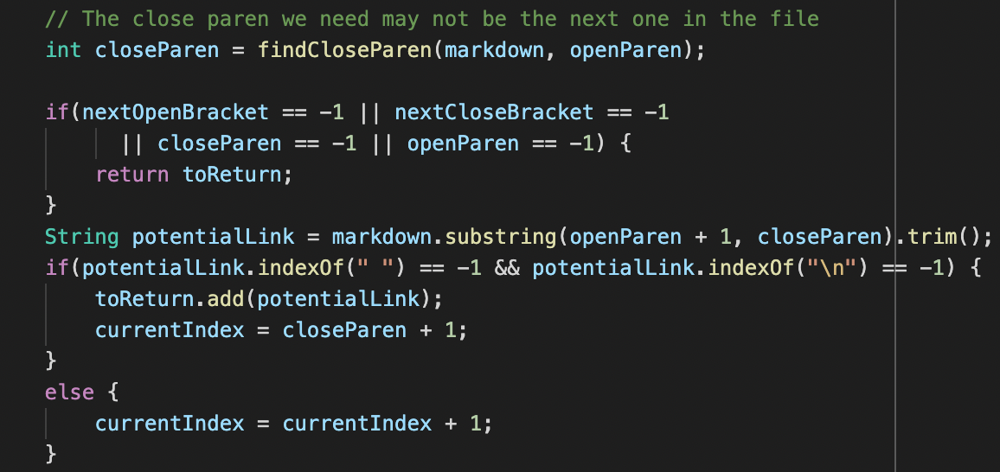

# Comparing Tests and Implementations Programmatically

 

## **How I Compared My Test Results to the Professor's Test Results**
- ran the professor's markdown parse code against all of the test files in the professor's `markdown-parse` repository with `bash script.sh` and stored it locally in `results.txt` in the professor's repository
- ran my markdown parse code against all of the test files in the professor's `markdown-parse` repository with `bash script.sh` and stored it locally in `results.txt` in my own repository
- used the `diff` command with the file paths to my `results.txt` and the professor's `results.txt` to compare the outputs of each test and return any differences
- printed out names of test file that the output corresponds to so when differences between the two `results.txt` are found, I know exactly which one
 

---

 

## **Test #1**
 

Input From Test File: *`[link](/uri)`*  

- My Output: `[]`
- Professor's Output: `[\uri]`
- Expected Output: `[\uri]`

My markdown-parse implementation was wrong.
   

**Code to Change:**

In this code, the bug is indide the nested if-else statement. In order to make sure that there aren't any image links included in the final list, I had to check if the character at index before the open bracket was a `!`. However, if the open bracket was the first character in the markdown file, then I would get an `IndexOutOfBoundsException` when checking the character at the index before the open bracket. In order to solve this, I made sure to add a condition to only check if the index before the open bracket was greater than or equal to zero. However, because I included it in the same if-tehn statement, I am essentially saying that if there is a link that has its open bracket the first character, then I shouldn't add it. I need to find some other way of aranging the if-else statements to solve this problem.

---

 

## **Test #2**
 

Input From Test File: *``*  

- My Output: `[]`
- Professor's Output: `[train.jpg]`
- Expected Output: `[]`

The professor's markdown parse implementation was wrong because an image's link is not included in the final list of links.
   

**Code to Change:**

In this code, the bug is that there is no code that checks for the presence of an `!` after assigning `potentialLink` to the substring between the open and closed pareentheses. There needs to be another condition inside the second if-else statement that checks if `potentialLink.indexOf("!") == -1` to make sure that the link is not an image link. Only then should the link be added to the list of links that gets returned.